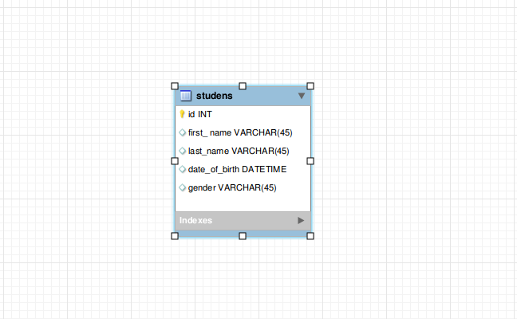

Hướng dẫn
=================
### Tạo table `students` dùng workbench



### Tạo `model` student
```
php artisan rocket:make:model students
```

Câu lệnh trên sẽ tạo ra model dưới
```php
class Student extends Base
{
    protected $table = 'students';
    
    protected $fillable = [
        'first_name',
        'last_name',
        'date_of_birth',
        'gender',
    ];
}
```
### Tạo `reopository` student 
```
php artisan rocket:make:repository students
```
câu lệnh trên sẽ tạo ra repository dưới
```php
class StudentRepository extends SingleKeyModelRepository implements StudentRepositoryInterface
{

    protected $querySearchTargets = [
        'first_name',
        'last_name',
    ];
    
    public function getBlankModel()
    {
        return new Student();
    }
}

```
### Tạo `service` student (optional)
```
php artisan rocket:make:service students
```
Câu lệnh trên sẽ tạo ra service dưới 
```php
class StudentService extends  BaseService  implements StudentServiceInterface
{

    public function __construct() {
    
    }

}
```


### Tạo `controller` student 
```php
use App\Http\Controllers\Controller;

class StudentController extends Controller {
    
}
```

### Tạo `response` student 
```php
namespace App\Http\Responses\Api\V1;

class Motorcycle extends Response
{
    protected $columns = [
        'id'                => null,
        'firstName'         => null,
        'lastName'          => null,
        'date_of_birth'     => null,
        'gender'            => null,
    ];
    
    public static function updateWithModel($model)
    {
        $response = new static([], 400);
        if (!empty($model)) {
            $modelArray = [
                'id'                => $model->id,
                'firstName'         => $model->first_name,
                'lastName'          => $model->last_name,
                'date_of_birth'     => $model->date_of_birth,
                'gender'            => $model->gender,
            ];
            $response = new static($modelArray, 200);
        }

        return $response;
    }
}


